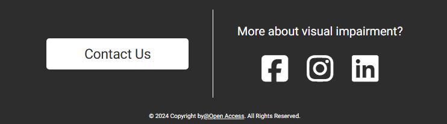

# Hackathon team 2  (Open Access)

# News Echo

## Project Description

News Echo is a platform designed to enhance digital accessibility, particularly for visually impaired users and individuals with motor skill challenges. By integrating features like screen reader support, voice navigation, and customisable viewing settings, News Echo ensures an inclusive and seamless browsing experience. The platform provides real-time news and weather updates, read aloud for convenience, and allows users to tailor display preferences to their specific needs. With a focus on accessibility and innovation, News Echo aims to break barriers and empower everyone to access and engage with content effortlessly.

[View the deployed website here](https://dasic002.github.io/2411-hackathon-team2/)

Preview Image [add img]

---

## Features

#### Logo

The logo features a minimalist and modern design that reflects the site’s focus on clarity and accessibility. The design is simple yet striking, ensuring the logo is easily recognisable and ties directly to the site’s name. It consists of two main elements:

1. Bold "N":
  - This represents the title "News Echo".
2.	Radiating Curves:
	- Two curved lines extend outward from the "N", resembling waves or signals. These represent communication, connection, and the spread of knowledge.

This logo captures the site's focus on accessibility and sharing information in a way that is easy for everyone to engage with. 

#### Navigation Menu

The navigation bar is very intutitive and easy to navigate through the different options of HOME - CONTACT US - FAQ.  When viewed on mobile the menu turns into a burger icon and expands to a full menu when enlarged for tablets and desktops. 

#### Hero Section

In the Hero section we can see displayed the choosen title of the app "NEWS ECHO" to enhance it's purpose. Depending of the day, the user is greeted by different messages: "Good Morning", "Good Afternoon" and "Good Evening". The user will be also able to check the current date depending on his timezone.

#### Weather Widget

The weather widget is displayed clearly, using a universal cloud symbol.  Todays current weather is displayed with a large volume speak button, when the user selects this the weather will be spoken out loud to them.  If they click and select anywhere on the weather it will display weather for the next couple of days. It is intuitive and easy to use. It has been designed with users who may have poor motor skills and or visual impairments. 

#### News Widget

The news widget is a large News symbol button with sound waves, when the user clicks on the large speaker button the news will be spoken to them.  They can choose to select to have the News headline title spoken to them first and they choose weather they wish to listen to the full article.  This allows to them to choose between different news articles that they are interested in.

#### Footer

The Footer is devided in two parts. In the first is displayed a "Contact us" button that bring the user to the Team page.
In the second part, the user will be able to access social media pages from an Irish association called "Fighting Blindness" if they need support or information.
The last part is about the Copyright with a link to the Team page.

#### Contact Page
The Contact Page provides a space to showcase the talented individuals behind the project. Rather than being a traditional contact form, this page serves as a “Meet the Team” section, giving visitors insight into the team members’ skills, backgrounds, and professional experiences.
Each team member is presented in a visually appealing format with a professional photo, name, role, and a brief personal introduction. The profiles highlight each member’s background, current expertise, and aspirations.

#### About Us Page
Meet the team who developed the website. Each team members bio, photo, linkedin and github profiles are clearly displayed with links that open in separate pages. 

#### FAQ Page
On our Frequently Asked Questions page, we’ve made it easier for users with poor motor skills or visual impairments to interact with the content. Instead of needing to click on a small arrow, you can click anywhere on the question to open or close the answer section.

The FAQ includes useful links to comprehensive guides from external sources to equip our user with knowledge of support services and accessible technology available.  We give clear instructions on how to change display settings on their apple or android devices.  We provide guidance if they have difficulties with our website, we explain how we handle personal information.  We explain how to use voice commands on the site and how our site is compatible with screen readers and other assistive technologies. 

A comprehensive guide to common frequently asked questions that our users may have enabling them to be better informed, independent technically savvy users.  

---

## Agile Workflow for GitHub Project Board

Agile methodology was used throughout the project.  At the beginning of the project, the team conducted a brainstorming session to generate ideas for the site's features. These ideas were captured as user stories and detailed into tasks with MoSCow proioties.  This initaial step was recorded on a google spreadsheet and categorisedto organise tasks efficientl and then transferred over to Project Boards on Github. On issues recorded on the Projects Board were recorded in a medhoical manner, in a step by step detail to ensure all tasks were detailed correctly to manage workflow and assign the correct team member to the task.  

A template was created to help write User Stories and define Epics.

#### Daily Workflow:
After the details of the project were recorded, each team member was allocated a must have task.  The more experienced members of the team outlined the best methodolgoy for working in a proficant manner within Gitpod and Github and clear instructions on git commands were pinned in the teams slack channel to ensure all team members understood and carried out the same commands to avoid conflicts.

The team leader kept detailed minutes of each sprint and followed up on issues from the previous sprint.  The team leader ensured all members of the team were allocated some time to discuss their particular tasks and any issues they were having and were given the appropriate advice from other team members.  

Each team worked using the project board and ticked off their tasks as they completed them and moved them to the approaite section.  The quality control team member after reviewing the code would create and allocate tasks which were highlighted to the team member as required. 

**Progress Updates**: At the end of each sprint, the board was reviewed:  
   - Items were moved to in progress
   - Completed tasks were moved to **Done**.  
   - Outstanding tasks were re-examined to determine which ones were most urgent for the following sprint.
   - Quality control team member reviewed outstanding bugs and allocated team member to review.

#### Completion:  
This iterative approach ensured that all issues were addressed, resulting in a fully functional website with all planned features successfully implemented.

#### Project Board

* Epics were written containing possible user stories and based on that the website was made.
* User stories were created by looking at epics and through iterations the project was advancing.
* Labels were added to sort the issues based on the importance which resulted to have unclosed issues as labelled as "won't have":
* Closed issues.
* Opened issues.
* The Project Board is set to public.
* The Project Board was used to track progression of the task through the Todo, In progress and Done columns:

#### User Stories

* As a user, I want to see current weather information for my location.
* As a user with visual impairments, I want to hear the weather information read aloud
* As a user, I want to browse latest news articles
* As a user, I want to hear news headlines and content read aloud
* As a user, I want to adjust text size throughout the application
* As a visually impaired user, I want to use keyboard shortcuts to navigate the website, so that I can easily move between sections without needing a mouse.
* As a developer, I want to implement semantic HTML and ARIA roles, so that screen readers can accurately interpret and navigate the page content.
* As a user, I want the site to function seamlessly on all device sizes, so that I have a consistent experience, whether on a mobile device or desktop.
* As a user concerned about privacy, I want clear information on how my location data is used, so that I feel secure using the service.
* As a user, I want to receive weather alerts for severe conditions, so that I can prepare accordingly.
* As a non-native English speaker, I want to include an option to choose a different language or voice for the text-to-speech conversion, so I can understand the information more easily.
* As a user I would like to have the option to adjust the speed or pitch of the audio, so I can listen comfortably.
* As a user I would like to see a FAQ section, so I can access common queries easily and self-serve.
* As a user, I can check today's weather by hours, so that I can dress accordingly.
* As a user, I can filter the news, so I can access the latest news of the topics I want.
* As a user, I would like to be able to navigate using the keyboard.

#### MoSCoW Prioritization: 
The MoSCow prioitization method was implemented on all issues and was reviewed after sprints. It was recorded on the issues of the project board and labelled accordingly. 

<h2>MUST HAVES:</h2>

* Create weather widget UI component
* Integrate with OpenWeatherMap or similar weather API
* Implement error handling
* Implement geolocation functionality
* Implement text-to-speech functionality using Web Speech API
* Create speech controls (play, pause, stop) - if needed for this widget
* Format weather data into readable text
* Create news section layout
* Integrate with a news API
* Implement error handling
* Implement article preview cards
* Add text-to-speech controls for each article
* Implement stop/pause functionality per article

<h2>SHOULD HAVES</h2>

<h2>WON'T HAVES</h2>
* Create text input area
* Implement text-to-speech conversion
* Add playback controls (check volume implementation ?)
* Implement PDF file upload
* Add PDF text extraction functionality

---

## Design

#### Colours

We described our project goals to ChatGPT and asked for 5 suggestions of a colour scheme for our application. We asked to include a background colour, a primary colour for headings, a secondary text and links, and an accent colour for buttons etc. Except for the background colour, we asked for 2 variations of each colour, leading to 5 colour schemes of 7 colours each:

<table>
 <tr>
        <th>Name</th>
        <th> Basic Color Scheme</th>
  </tr>
 <tr>
        <td><strong>1.</strong>(Classic Contrast)</td>
        <th></th>
  </tr>
   <tr>
        <td><strong>2.</strong> (Subdued Sophistication)</td>
        <th></th>
  </tr>
   <tr>
        <td><strong>3.</strong> (Nature Inspired)</td>
        <th></th>
  </tr>
   <tr>
        <td><strong>4.</strong> (Warm Embrace)</td>
        <th></th>
  </tr>
   <tr>
        <td><strong>5.</strong> (Monochrome Modernity)</td>
        <th></th>
  </tr>
</table>

Keeping our user personas in mind, we then wanted to test how these colours would be seen by with different types of visual impairments, namely Colour Vision Deficiency. We created a mockup for our landing page and tested each layout for 8 types of colour blindness using a [Color Blind Vision Simulator](https://pilestone.com/pages/color-blindness-simulator-1?srsltid=AfmBOooS3NaYz6ZSMBzkC52-VBPHp0FpKVg1DJi_okGUmlTMUueONlkM) :

- Green-weak (Deuteranomaly)
- Red-weak (Protanomaly)
- Blue-weak (Tritanomaly)
- Monochromacy (Tritanomaly)
- Red-blind (Protanopy)
- Green-blind (Deuteranopy)
- Blue-blind (Deuteranopy)
- Blue Cone Monochromacy

<table>
 <tr>
        <th>Color Scheme</th>
        <th>Contrast Grid</th>
  </tr>
 <tr>
        <td><strong>1.</strong>(Classic Contrast)</td>
        <th></th>
  </tr>
   <tr>
        <td><strong>2.</strong> (Subdued Sophistication)</td>
        <th></th>
  </tr>
   <tr>
        <td><strong>3.</strong> (Nature Inspired)</td>
        <th></th>
  </tr>
   <tr>
        <td><strong>4.</strong> (Warm Embrace)</td>
        <th></th>
  </tr>
   <tr>
        <td><strong>5.</strong> (Monochrome Modernity)</td>
        <th></th>
  </tr>
</table>

We also used [EightShapes](https://contrast-grid.eightshapes.com/) to determine the contrast between each of the 7 shades of each colour scheme.

<table>
<tr>
      <th>Color Contrast Combinations</th>
  </tr>
  <tr>
      <td></td>
  </tr>
</table>

All colour schemes were readable for individuals with various types of visual impairments. Our criteria for choosing a scheme were:

- The colours should be visually inviting across different types of impairments
- The colours need to align with the website's purpose. In the morning, after waking up, warmer tones might be more comfortable for the eyes, as they can help reduce overstimulation.
- The colour combinations should achieve a high AAA rating or better, making them well-suited for our intended application with high colour contrast.

Based on these criteria, we observed:

- Colour Schemes 2, 3 and 5 look a bit strange for certain types of impairments
- Colour scheme 1 has a strong visual contrast and is visually appealing across impairment types. The bright tone could help with waking up.
- Colour schemes 2 and 5 score lower than the other schemes for certain combinations

Our final chosen colour scheme was **Color Scheme 1 (Classic Contrast)**, based on the results and a vote amongst our team members.

#### Typography

 - Based on reseach into font that was readable to people with visual impairments and dyslexia the font type Roboto and sans-serif were chosen as the sites primary font.
   
#### UX Research

To inform our design and layout decisions, we adopted a user-centric approach and sought to create user personas. We outlined our project goals to ChatGPT and asked for assistance in generating five user personas that represent our target audience for the application:

<table>
    <tr>
        <th>Name</th>
        <th>Description</th>
    </tr>
    <tr>
        <td>
            
            
Michael 

            
The Independent Visionary 

          </hd>
        <td>
            <ul>
              <li>Age: 34</li>
              <li>Occupation: Software Engineer</li>
              <li> Visual Impairment: Moderate vision loss due to retinitis pigmentosa</li>
              <li>  Tech Proficiency:  High</li>
              <li>  Location: Urban area</li>
              <li>  Goals:  Stay informed about current weather and news without straining his eyes. Use technology to maintain an independent lifestyle</li>
              <li>  Frustrations: Websites that aren't compatible with screen readers.
            Unorganized information that makes navigation difficult.</li>
              <li>  Preferred Features: Voice-assisted navigation and news reading.
            High-contrast design and adjustable text sizes.</li>
            </ul>
        </td>
    </tr>
      <tr>
        <td>
            
            
Linda 

            
The Devoted Caregiver 

          </hd>
        <td>
            <ul>
              <li>Age: 52</li>
              <li>Occupation:  Homemaker</li>
              <li> Role: Caregiver to her visually impaired teenage son</li>
              <li>  Tech Proficiency:  Moderate</li>
              <li>  Location: Suburban area</li>
              <li>  Goals: Find reliable resources that support her son's independence.
            Simplify access to information for her son.</li>
              <li>  Frustrations: Limited resources and tools specifically catering to teenagers with visual impairments. Complicated technology that her son struggles to use.</li>
              <li>  Preferred Features: Simple and intuitive UI for easy learning.
          Personalization options to cater to specific needs..</li>
            </ul>
        </td>
    </tr>
  </tr>
    <tr>
        <td>
            
            
Sarah 

            
The Outreach Advocate 

          </hd>
        <td>
            <ul>
              <li>Age: 45</li>
              <li>Occupation: Non-profit Worker in Vision Rehabilitation Services</li>
              <li> Visual Impairment:  None</li>
              <li>  Tech Proficiency:  Moderate</li>
              <li>  Location:  Rural area</li>
              <li>  Goals: Advocate for better technological solutions for visually impaired individuals. Educate clients on accessible technology.</li>
              <li>  Frustrations: Lack of awareness about assistive technologies.
Continuous adaptation to new technologies for her clients.</li>
              <li>  Preferred Features: Comprehensive guides for educators and caregivers.
Supportive community or feedback section for sharing insights.</li>
            </ul>
        </td>
    </tr>
   <tr>
        <td>
            
            
David 

            
The News Enthusiast 

          </hd>
        <td>
            <ul>
              <li>Age: 67</li>
              <li>Occupation: Retired Teacher</li>
              <li> Visual Impairment: Age-related macular degeneration</li>
              <li>  Tech Proficiency:  Moderate</li>
              <li>  Location: Urban area</li>
              <li>  Goals: Keep up with daily news and weather predictions without dependency on others. Utilize voice features to circumvent declining eyesight.</li>
              <li>  Frustrations: Small fonts and cluttered web layouts.
Slow-loading pages or sites that are not voice-enabled.</li>
              <li>  Preferred Features: Customized news content read aloud at scheduled times.Easy navigation using large buttons and a simplified layout.</li>
            </ul>
        </td>
    </tr>
 <tr>
        <td>
            
            
Anika 

            
The Tech-Savvy Student 

          </hd>
        <td>
            <ul>
              <li>Age: 16</li>
              <li>Occupation: High School Student</li>
              <li> Visual Impairment: Congenital blindness </li>
              <li>  Tech Proficiency:  High</li>
              <li>  Location: Suburban area</li>
              <li>  Goals: Access weather updates for planning daily activities. Stay informed on current events relevant to her interests.</li>
              <li>  Frustrations: Limited age-appropriate visual impairment tools. Sometimes feels left out of mainstream media consumption.</li>
              <li>  Preferred Features: Engaging content presentation with voice customization. Interactive elements that work well with assistive tech devices.</li>
            </ul>
        </td>
    </tr>
</table>

---

## Technologies

- HTML5
- CSS
- Javascript
- Google Fonts
- Font Awesome
- ...

---
## Future Implementation
* Pdf to speech, a user could paste a pdf into the site and it would be read aloud.
* Implement text-to-speech conversion
* Create theme switcher component
* Implement high contrast theme
* Create color-blind friendly themes
* Store user theme preference

## Testing
We took a systematic and structural approach to manually test each page to ensure it functions correctly and to help identify potential bugs. We created a specific testing template to ensure and re-check all aspects of the app were working correctly as specified with expected and actual outcomes using a methodical approach. We did final testing on the deployed site.

We manually tested all available features to ensure they were working as intended.
We carried out various intensive testing to see if any errors occurred. Errors were fixed and it works well without any bugs.

#### HTML validator

#### CSS validator

#### Responsiveness
We created the website using the mobile first technique and created screen queries to accommodate the site on larger sizes. 

#### Accessibility

* Weather can be read aloud to people with visual impairments.
* News can read aloud to people with visual impairments.
* User can be in control of what they want to listen to.
* User can navigate easily using keyboard instruction.
* Clean, unclutterd easy to navigate
* Meaningful Alt descriptions on all images making it suitable for screen readers and descriptive for screen reader users.
* Large buttons used thoughout website to aid people with difficulties with motor skills.
* Aria labels used to describe the content for screen readers and other accessibility tools.
* Detailed color analysis as outlined in the design section above was implmented.
* Colors suitable for people who are visually impaired was utilised
* Font type Roboto, sans serif text was researched and used due to its suitablity for people with visually impairments and dyslexia.
* Background and contrast colors were tested and worked efficiently and clearly.
* After running our deployed site in incognito mode using Lighthouse any issues that were identified were recitified.
* 

#### Performance

#### Lighthouse

---

## Deployment

1. The site is Deployed using GitHub Pages
2. Login to GitHub
3. Go to the projects repository (https://github.com/users/dasic002/projects/4)
4. Click on Settings
5. Select pages in the left navigation bar
6. From SOURCE dropdown select Deploy from a Branch
7. Under BRANCH from dropdown select Main Branch and SAVE
8. The site is now deployed but may take a few minutes to go live.
9. Return to CODE tab of Github repo and wait a few minutes for build to finish, refresh page. This will show on github-pages to see active deployments.

How to Fork:

1. Login to Github
2. Go to Project repository
3. Click the FORK button top right corner
4. How to Clone
5. Log into Github
6. Go to project repository
7. Click on the code button, select what want to clone HTTPS, SSH or GitHub CLI and copy the link.
8. Open the terminal in your code editor and change the current working directory to the location you want to use for the cloned directory
9. Copy 'git clone' into the terminal and paste the link you copied in step 3. Press enter.
    
## Version Control 

The site was developed by a team of 7 using Git for version control, with all code managed in the **"main"** GitHub repository. Our workflow included the following key Git commands:

- **Daily Workflow**:  
  - `git checkout main` – Switch to the main branch.  
  - `git pull origin main` – Fetch and integrate the latest changes from the remote main branch.  
  - `git checkout <your-branch>` – Switch back to your feature branch.  
  - `git merge main` – Merge the latest changes from the main branch into your branch.  

- **Stashing Changes**:  
  - `git stash push -u -m "Your stash message"` – Temporarily save your changes.  
  - `git stash apply` – Reapply stashed changes after syncing with the main branch.

- **Committing and Pushing Changes**:  
  - `git add .` – Stage all changes (or specify individual files).  
  - `git commit -m "Description of your changes"` – Commit changes with a descriptive message.  
  - `git push origin <branch-name>` – Push committed changes to the remote repository.

This structured Git workflow allowed our team to collaborate effectively and manage changes efficiently throughout development.

#### GitHub Pages

---

## Team
We had an amazing and hard working group of people working on this project who dedicated many hours to the project and also supported their other team mates. 

#### Carlos
Carlos lead the team as Team Leader from the start and did an amazing job of keeping sprints on schedule, tasks reviewed and everyone motivated. 

#### Charlie
Charlie did a fabulous job of creating a lovely teams page and supporting other team members. 

#### Eugénie
Eugénie did a great job of the header and footer of the page and offering support and advice throughout the project. 

#### Ioan
We cannot say enough about Ioan, his coding skills and work rate were phenomenal.  He put a lot of work and time into this project and it is much appreciated. He was a huge support to the team with his extensive knowledge.

#### Nils
Nils attention to detail in all aspects of the project was fantastic.  His coding skills to navigate the menu bar and quality assurance to ensure all accessibility code was implemented was invaluable.  He was a huge support to other team members and was always happy to take a huddle to give advice to other team members. 

#### Shantel
Shantel assisted with the readme document and the error 404 page and was great help with the final sprint home. 

#### Viki
Viki did the FAQ page and assisted with the Readme documentation and thoroughly enjoyed the whole hackathon and leart many new things! 

---

## Credits

- [Color Blind Vision Simulator](https://pilestone.com/pages/color-blindness-simulator-1?srsltid=AfmBOooS3NaYz6ZSMBzkC52-VBPHp0FpKVg1DJi_okGUmlTMUueONlkM) for testing the layout with different types of visual impairment
- [EightShapes Contrast Grid](https://contrast-grid.eightshapes.com/?version=1.1.0&background-colors=&foreground-colors=D3D3D3%0D%0A000000%0D%0A1C1C1C%0D%0A708090%0D%0AD3D3D3%0D%0AFF4500%0D%0ADC143C%0D%0A&es-color-form__tile-size=compact&es-color-form__show-contrast=aaa&es-color-form__show-contrast=aa&es-color-form__show-contrast=aa18&es-color-form__show-contrast=dnp) to test foreground and background color combinations of color schemes
- [Figma](https://www.figma.com/?utm_source=google&utm_medium=cpc&utm_campaign=21284800768&utm_term=figma&utm_content=699203569592&utm_adgroup=169015406544&gad_source=1&gclid=Cj0KCQiAouG5BhDBARIsAOc08RT5SSwtM37YXnnUR-UkkFcYTGjyeAprApI-kRAqisRzVAo61hUlp-caAi-OEALw_wcB) to create project logo
- [Stackoverflow] (https://stackoverflow.com/questions/10813581/can-i-replace-the-expand-icon-of-the-details-element) for inspiring code to create a larger area for users to click in the faq question section.

We would like to thank Andrew our Hack Lead whom we always available for support if we needed it.  Thank you to CI for organising a great hackathon, accessibility is such an important and often forgotton aspect for many people living their day to day lives, this opportunity to create this webpage has made us all more informed about coding with accessibility to the forefront of our minds. We would like to also thank any partners, family, friends, children and pets that may have been neglected over the last few days ;) 

## Content

* The background image for the hero section was found on [Pexels](https://www.pexels.com/).

